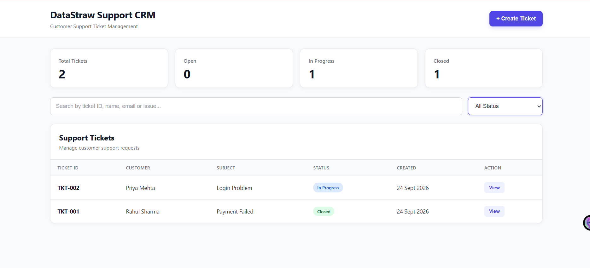

# 🎫 DataStraw Support CRM

A full-stack **Customer Support Ticketing CRM System** built as part of the **DataStraw AI Data Engineering Intern Assessment**.

The application allows support teams to create, manage, search, filter, and update customer support tickets through a clean and responsive web interface.

---

## 🚀 Features

### 🎫 Ticket Management

* Create new support tickets
* Automatically generate unique Ticket IDs
* Automatically record ticket creation time
* View all customer support tickets
* View complete ticket details
* Update ticket status
* Add notes/comments to tickets

### 🔍 Search & Filter

* Search tickets by:

  * Customer name
  * Ticket ID
  * Customer email
  * Subject
  * Issue description
* Filter tickets by:

  * Open
  * In Progress
  * Closed

### 📊 Dashboard

The dashboard displays:

* Total Tickets
* Open Tickets
* In Progress Tickets
* Closed Tickets

### 📱 Responsive UI

* Clean CRM-style interface
* Responsive design
* Search and filtering controls
* Ticket detail modal
* Create ticket modal
* Status badges

---

## 🛠️ Tech Stack

### Backend

* Python
* FastAPI
* SQLAlchemy
* Pydantic
* SQLite

### Frontend

* HTML5
* CSS3
* JavaScript
* Fetch API

### Development Tools

* VS Code
* Git
* GitHub
* FastAPI Swagger UI

---

## 🏗️ Project Structure

```text
datastraw-support-crm/
│
├── backend/
│   ├── main.py
│   ├── database.py
│   ├── models.py
│   ├── schemas.py
│   └── crud.py
│
├── frontend/
│   ├── index.html
│   ├── style.css
│   └── script.js
│
├── .gitignore
├── README.md
└── venv/             t
```

---

## 🗄️ Database Design

The application uses **SQLite** with two tables.

### Tickets

| Field          | Type     | Description                 |
| -------------- | -------- | --------------------------- |
| id             | Integer  | Primary key                 |
| ticket_id      | String   | Unique ticket ID            |
| customer_name  | String   | Customer name               |
| customer_email | String   | Customer email              |
| subject        | String   | Ticket subject              |
| description    | Text     | Issue description           |
| status         | String   | Open / In Progress / Closed |
| created_at     | DateTime | Ticket creation time        |
| updated_at     | DateTime | Last update time            |

### Notes

| Field      | Type     | Description                     |
| ---------- | -------- | ------------------------------- |
| id         | Integer  | Primary key                     |
| ticket_id  | Integer  | Foreign key referencing Tickets |
| note_text  | Text     | Support note/comment            |
| created_at | DateTime | Note creation time              |

---

## 🔗 REST API

### 1. Create Ticket

```http
POST /api/tickets
```

Request body:

```json
{
  "customer_name": "Rahul Sharma",
  "customer_email": "rahul@gmail.com",
  "subject": "Payment Failed",
  "description": "My payment was unsuccessful."
}
```

Response:

```json
{
  "ticket_id": "TKT-001",
  "created_at": "2026-09-25T08:00:00"
}
```

### 2. Get All Tickets

```http
GET /api/tickets
```

Optional query parameters:

```text
?status=Open
?search=Rahul
```

Example:

```http
GET /api/tickets?status=Open&search=Rahul
```

### 3. Get Ticket Details

```http
GET /api/tickets/{ticket_id}
```

Example:

```http
GET /api/tickets/TKT-001
```

Returns complete ticket information including notes.

### 4. Update Ticket

```http
PUT /api/tickets/{ticket_id}
```

Request body:

```json
{
  "status": "In Progress",
  "notes": "Support team is checking the issue."
}
```

Response:

```json
{
  "success": true,
  "updated_at": "2026-09-25T08:30:00"
}
```

---

## ⚙️ How to Run Locally

### 1. Clone the Repository

```bash
git clone https://github.com/Nikkiram435/ticket-management-system.git
```

Move into the project:

```bash
cd ticket-management-system
```

### 2. Create Virtual Environment

```bash
python -m venv venv
```

Activate it on Windows:

```bash
venv\Scripts\activate
```

### 3. Install Dependencies

```bash
pip install fastapi uvicorn sqlalchemy pydantic email-validator
```

### 4. Start the Backend

Move into the backend directory:

```bash
cd backend
```

Run FastAPI:

```bash
uvicorn main:app --reload
```

Backend will run at:

```text
http://127.0.0.1:8000
```

### 5. Open API Documentation

FastAPI automatically provides Swagger documentation:

```text
http://127.0.0.1:8000/docs
```

### 6. Start the Frontend

Open another terminal.

Move to the frontend directory:

```bash
cd frontend
```

Run the frontend server:

```bash
python -m http.server 5500
```

Open:

```text
http://localhost:5500
```

---

## 🔄 Application Flow

```text
User
 │
 ▼
Frontend
 │
 │ HTTP Requests
 ▼
FastAPI Backend
 │
 ▼
CRUD Operations
 │
 ▼
SQLAlchemy
 │
 ▼
SQLite Database
```

---

## 🧪 API Testing

The APIs were tested using FastAPI Swagger UI.

Tested operations include:

* Create ticket
* Retrieve all tickets
* Search tickets
* Filter tickets by status
* Retrieve ticket details
* Update ticket status
* Add ticket notes

---

## 📸 Screenshots



### Dashboard

*Add dashboard screenshot here.*

### Create Ticket

*Add create ticket screenshot here.*

### Ticket Details

*Add ticket details screenshot here.*

---

## 🎯 Assessment Requirements Covered

| Requirement          | Status |
| -------------------- | ------- 
| Create Tickets       | ✅      |
| Auto Ticket ID       | ✅      |
| Auto Timestamp       | ✅      |
| List Tickets         | ✅      |
| Search Tickets       | ✅      |
| Status Filter        | ✅      |
| Ticket Details       | ✅      |
| Update Status        | ✅      |
| Add Notes            | ✅      |
| SQLite Database      | ✅      |
| REST APIs            | ✅      |
| Responsive Frontend  | ✅      |
| Dashboard Statistics | ✅      |

---

## 🔮 Future Improvements

Possible future enhancements include:

* User authentication and role-based access
* Pagination for large ticket datasets
* Email notifications
* AI-powered ticket categorization
* Automatic priority detection
* Sentiment analysis
* AI-generated support response suggestions
* Advanced analytics and reporting
* Cloud database integration

---

## 👩‍💻 Author

**Nikki Ram**

B.E. Artificial Intelligence & Machine Learning

**GitHub:**
https://github.com/Nikkiram435

**LinkedIn:**
https://www.linkedin.com/in/nikki-ram-339244289/

---

## 📄 License

This project was developed for educational and assessment purposes.
